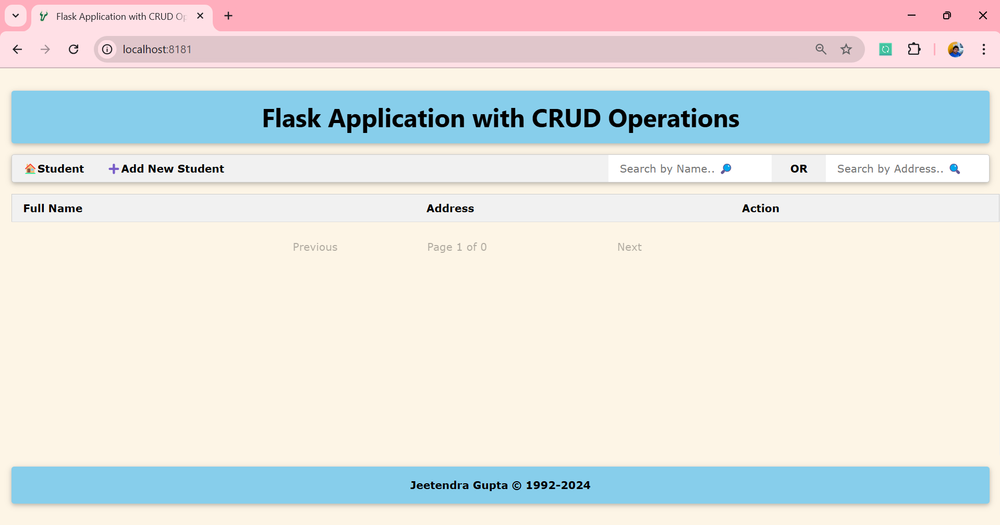
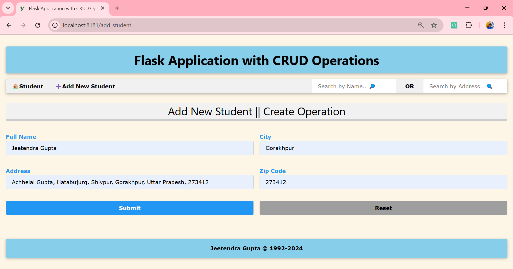
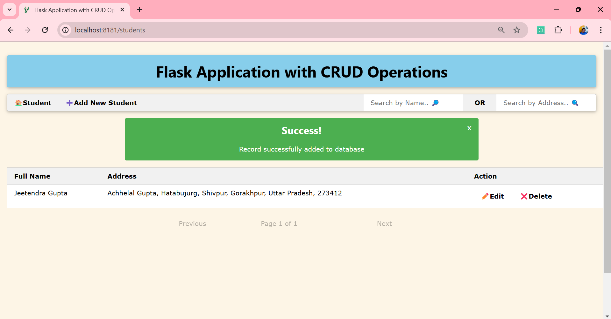
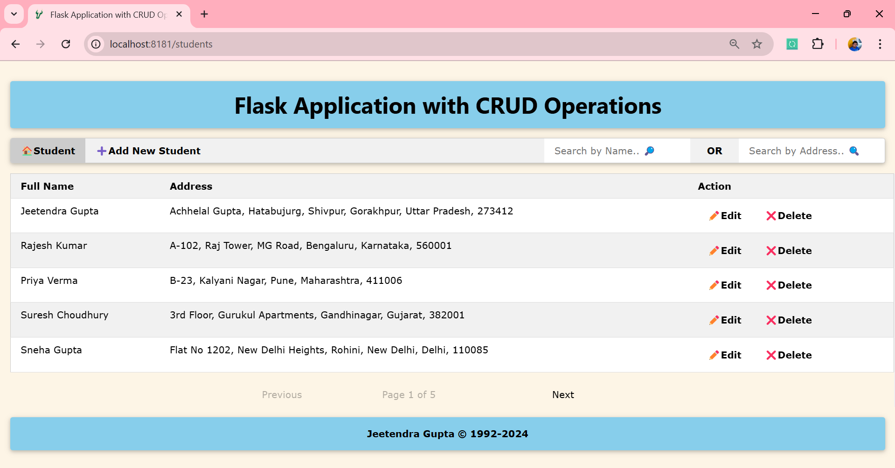
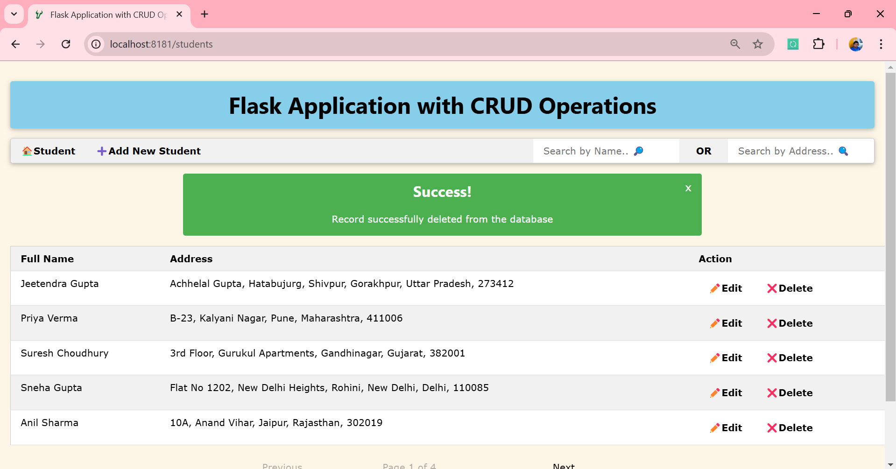
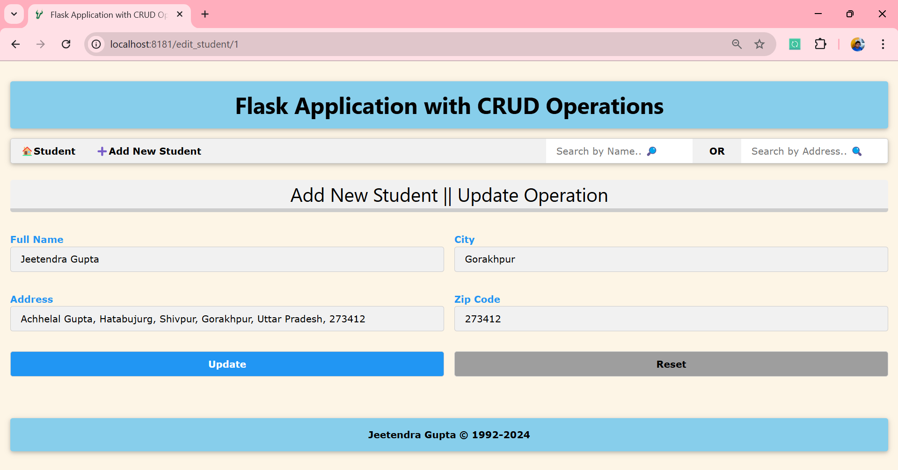
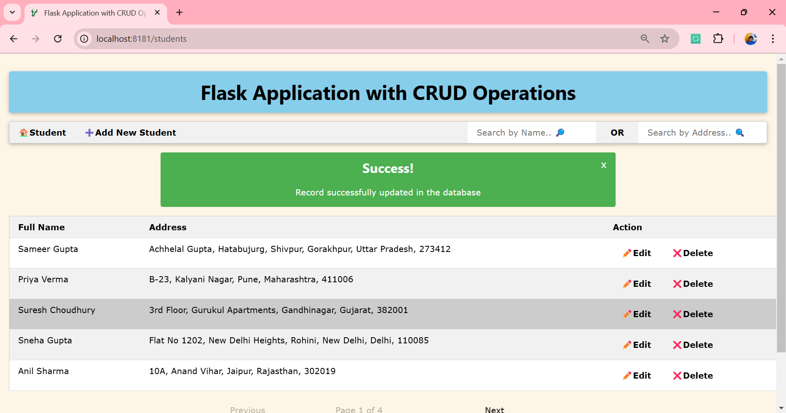
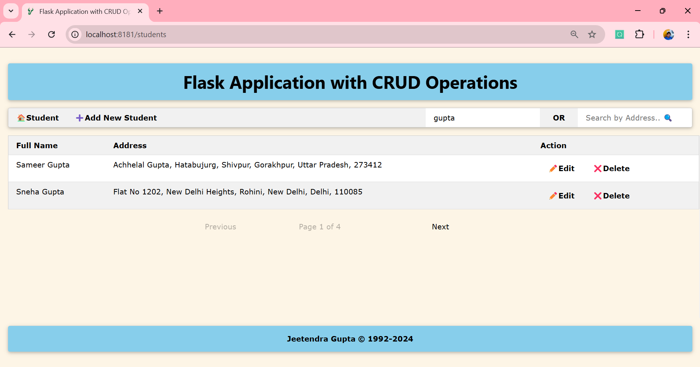
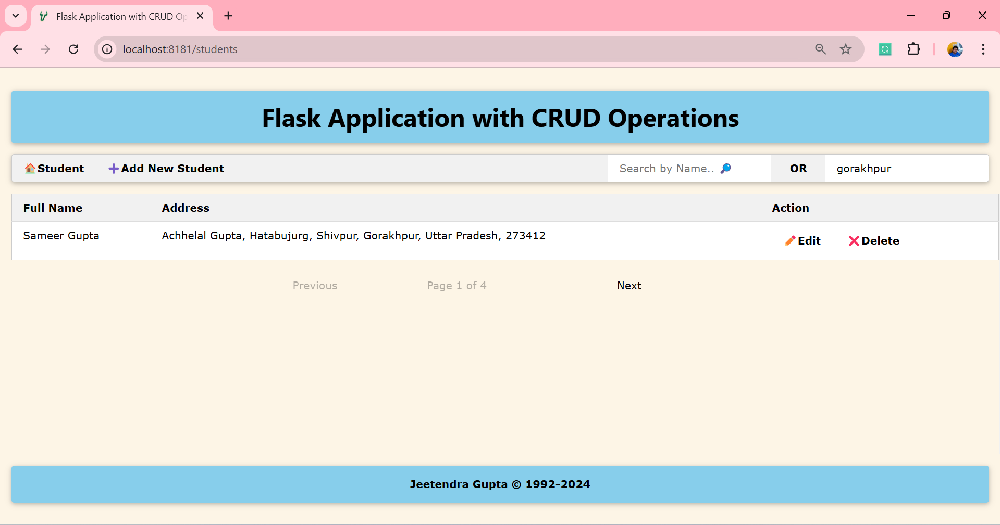

# Flask CRUD Application with SQLAlchemy

This is a simple CRUD application built with Flask and SQLAlchemy. The application allows you to manage student records,
providing functionality to create, read, update, and delete student data. The project uses SQLite as a database and
follows web application principles for routing.

## Table of Contents

- [Features](#features)
- [Technologies](#technologies)
- [Installation](#installation)
- [Usage](#usage)
- [Images](#images)

## Features

- Add a new student.
- View all students with pagination.
- Update student details.
- Delete student records.
- Search by name or address.

## Technologies

- **Flask**: A lightweight web framework.
- **SQLAlchemy**: ORM for interacting with the database.
- **SQLite**: Lightweight database (in-memory for testing, file-based for production).
- **python-dotenv**: For managing environment variables.

## Installation

### Prerequisites

- Python 3.x
- pip (Python package manager)

### Steps to Install

1. Clone the repository:

    ```bash
    git clone https://github.com/jeetendra29gupta/flask-crud-app.git
    cd flask-crud-app
    ```

2. Install the required dependencies:

    ```bash
    pip install -r requirements.txt
    ```

3. Create a `.env` file in the root of the project and add the following environment variable:

    ```
    SECRET_KEY=your_secret_key
    DATABASE_URI=sqlite:///your_database_file.db
    ```

   > Replace `your_secret_key` and `your_database_file.db` with your actual values.

## Usage

To run the application:

```bash
python main_app.py
```

This will start the Flask server on `http://127.0.0.1:8181`. You can then use the following routes:

- `GET /students`: View the list of students (with pagination).
- `GET /add_student`: Add a new student.
- `GET /edit_student/<roll_number>`: Edit student details.
- `GET /delete_student/<roll_number>`: Delete a student record.

## Images

> **Index Page**


> **Adding New Record**


> **Added New Record**


> **Display records using a pagination system**


> **Delete the given record**


> **Updating the record**


> **Updated the record**


> **Search by name using JS**


> **Search by address using JS**

